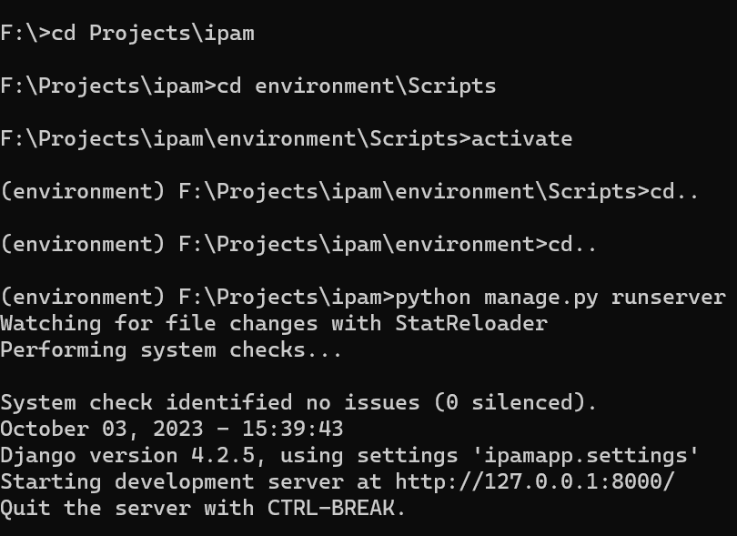
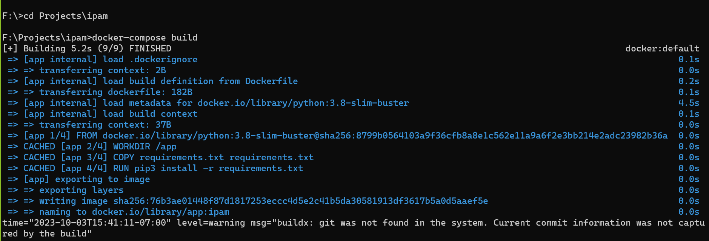
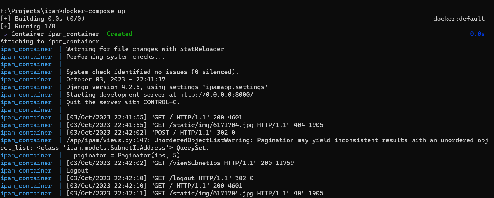

## Prequisites:
Python and git should be installed on your system. The recommended version is python 3.11.

## Cloning the repositary
The first step is to clone the repositary on your system so that you have all necessary files to run the project. For that navigate to the repositary and copy the https url or ssh path then in your command prompt run the command 
```
git clone https://github.com/khansaa18/task_mangement.git
```
## Activating virtual environment
Now that you have the project files, open a command prompt and navigate to the project root directory using the change directory(cd) command. Run the following command
```
cd environment\Scripts
```
Once done, type activate and press enter. This is to run the activate batch file and activate the environment that will be used to run the application.

## Running the project
Now that we have the environment activated, you are now able to run the project. 
Use the cd command to go back to the project root directory and then navigate to the taskmanagement project directory where the manage.py is located.

After that run the following command to start the application
```
python manage.py runserver
```
Here is a screenshot of the command prompt window that shows all the steps:

Now we are serving the application. The cmd will show you the address on which the application is running on. Copy and paste that url in the browser and press enter. .Now you will taken to the login page of the application.
Use the following credentials for logging in as admin:
```
Username: admin
Password: admin
```

## Running with docker compose
The application can also be started in a docker
container using docker compose. Navigate to the project
root directory using a command prompt and run the
following command
```
docker-compose build
```

Then when the image is built run the next command to start ipam.
```
docker-compose up
```

Navigate to *http://localhost:8000/* to access the application once it is started. 

##### Note that docker should be installe and running on the local machine for the docker commands to work


